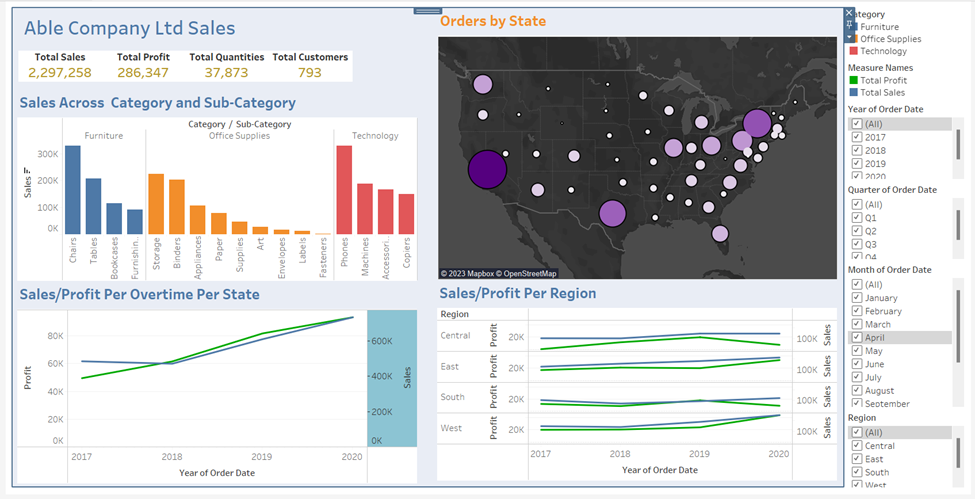

# *Redesigned Journey*

## Description
Visualized superstores data in Tableau

## :camera_flash: Dashboard Screenshots

## :relaxed: Overview and Objectives
Able Company Ltd. is a chain of department stores that sells a wide range of products, including phones and different components. Despite having a large customer base, the company has been struggling to make meaning out of their data. The management team is looking to use data analysis to understand key metrics and make changes to their sales and marketing strategies to improve performance.

The company collected data on customer demographics, purchasing history, and other relevant information over a 4-year period. The data includes information on the products purchased, the price paid, and the date of purchase, etc.
Visualize the following metrics.   

1. Total number of customers.
2. Total quantities ordered. 
3. Total Sales
4. Orders by State
5. Highest & lowest sales across Category and sub-category.
6. The trend in profit/sales over time (years/months/quarters).
7. The trend in profit/sales over region (years/months/quarters)

## :scroll: Author
Gloria Givondo

## License
The content of this site is license under the MIT license
Copyright (c) 2024 **Gloria**